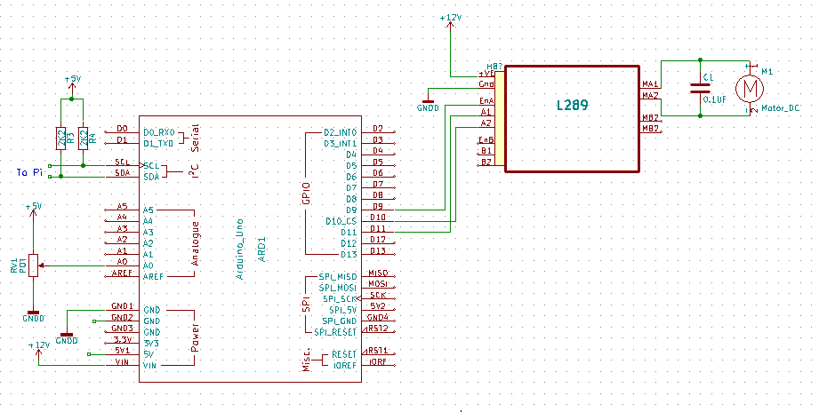
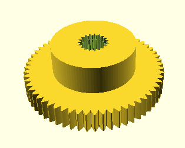
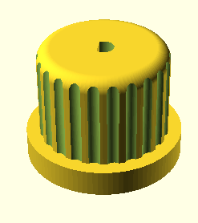

# JumboServo
## A jumbo sized servo controlled with I2C

This project was created provide the motion for the Robotic Water Sentry (aka Triffid) and control the motion of the nozzle. 

As big servos were expensive I thought I could build one from an Arduino, Potentiometer and and small Motor with Gearbox.

## Parts

* Adafruit 5v Itsybitsy
* L298 H-Bridge module
* 10K Linear Potentiometer
* 2x 220R resistor
* Wire
* Connectors
* Motor with gearbox

Along with the electronics is a metal plate to hold the motor and potentiometer and a wooden case styled in the design of a servo. I used a [MFA/COMODRILLS 919D motor gearbox](https://www.mfacomodrills.com/gearboxes/919d_series.html).

## Electronics

The schematic for the project is provided in KiCad format.

The key points are that the enable wire for the H-Brige module should be one of the PWM enabled pins on your Arduino. The two control pins should be determined so that when the motor is running forward the values from the analogue input increment and vice versa. It's recommended that you test this with the gear for the potentiometer disconnected.

## Code

There's two lots of code here. The "Servo" folder is the code that runs on the servo and the "Controller" folder is demo project for a test rig with uses an LCD and some buttons to control the servo.

## 3D Models

There are two models provide the gear to fit the potentiometer and the spindle for the output shaft. These were built using OpenSCAD. Note that you may need to adjust the internal size of the gear and spindle to get a good fit on your pot/motor output shaft.

 