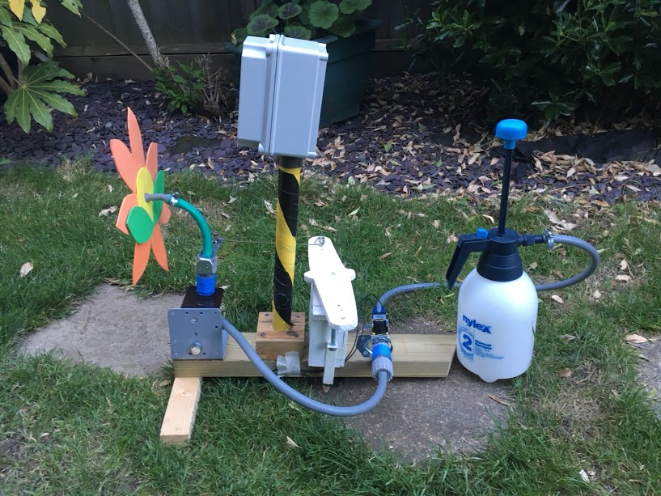
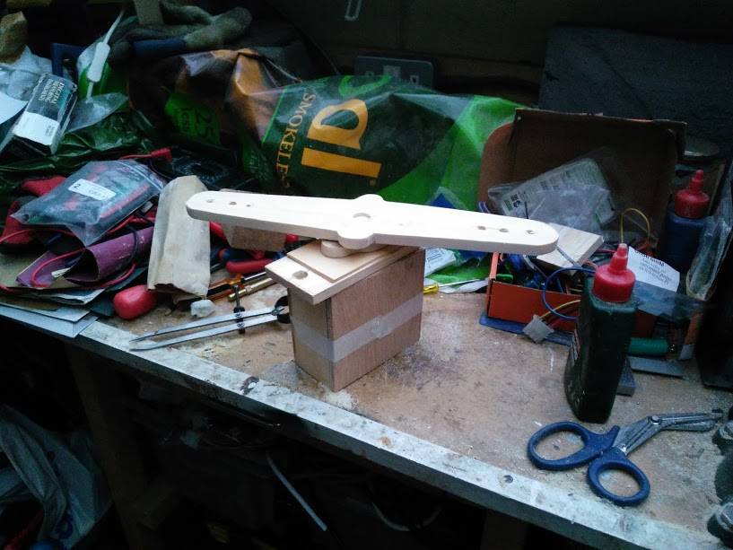
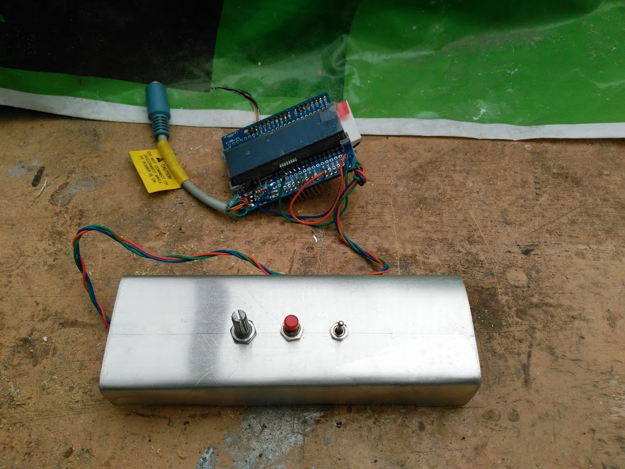

# JumboServo
## A jumbo sized servo controlled with I2C

This project was created provide the motion for the Robotic Water Sentry (aka Triffid) and control the motion of the nozzle. 

As big servos were expensive I thought I could build one from an Arduino, Potentiometer and and small Motor with Gearbox.

## Parts

* Adafruit 5v Itsybitsy
* L298 H-Bridge module
* 10K Linear Potentiometer
* 2x 220R resistor
* Wire
* Connectors

Along with the electronics is a metal plate to hold the motor and potentiometer and a wooden case styled in the design of a servo.

## Code

There's two lots of code here. The "Servo" folder is the code that runs on the servo and the "Controller" folder is demo project for a test rig with uses an LCD and some buttons to control the servo.

